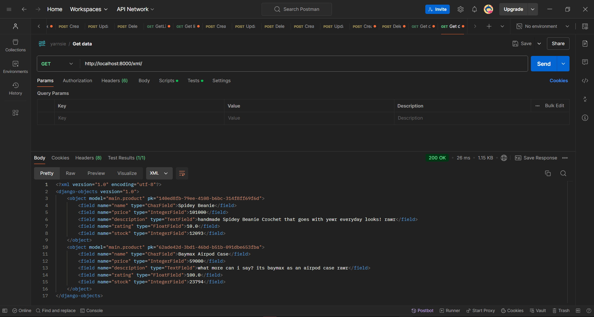
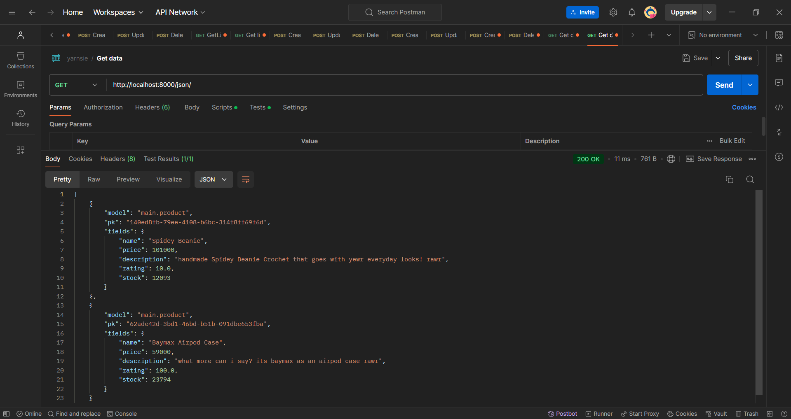
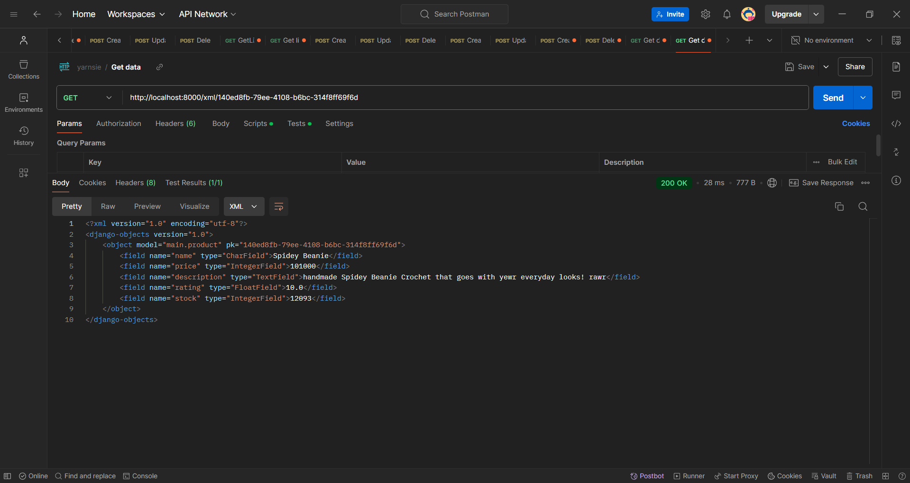
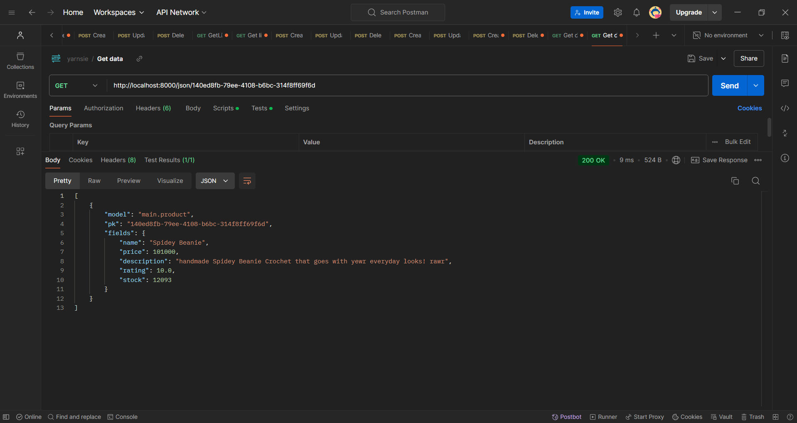

Nama : Shaney Zoya Fiandi

NPM : 2306215923

Kelas : PBP A

Tautan PWS : http://shaney-zoya-yarnsieproject.pbp.cs.ui.ac.id/

# Tugas 4
## Apa perbedaan antara HttpResponseRedirect() dan redirect()?
*HttpResponseRedirect()* adalah kelas yang secara manual mengembalikan respons redirect ke URL tertentu, sementara *redirect()* adalah fungsi utilitas yang lebih fleksibel dan bisa digunakan untuk mengarahkan ke URL, view, atau objek model. *redirect()* sering digunakan karena lebih ringkas dan mudah dalam berbagai situasi.

## Jelaskan cara kerja penghubungan model MoodEntry dengan User!
Dalam menghubungkan model Product dengan User, kita biasanya menggunakan ForeignKey di model Product. ForeignKey ini menunjukkan bahwa setiap produk memiliki relasi ke satu pengguna. Misalnya, dalam Django, kita dapat menambahkan atribut seperti user = models.ForeignKey(User, on_delete=models.CASCADE) di model Product untuk menghubungkan produk dengan pengguna yang membuatnya.

## Apa perbedaan antara authentication dan authorization, apakah yang dilakukan saat pengguna login? Jelaskan bagaimana Django mengimplementasikan kedua konsep tersebut.
Authentication (otentikasi) adalah proses untuk memverifikasi identitas pengguna, seperti melalui username dan password. Sedangkan, authorization (otorisasi) adalah proses memeriksa apakah pengguna yang telah terverifikasi memiliki izin untuk mengakses fitur atau sumber daya tertentu. Saat pengguna login, mereka melalui proses otentikasi untuk memastikan identitas mereka. Django mengimplementasikan otentikasi dan otorisasi melalui framework authentication, yang menyediakan fungsi login() dan logout() untuk otentikasi, serta sistem izin (permissions) dan grup (groups) untuk mengelola otorisasi.

## Bagaimana Django mengingat pengguna yang telah login? Jelaskan kegunaan lain dari cookies dan apakah semua cookies aman digunakan?
Django menjaga pengguna yang sudah login dengan memanfaatkan session dan cookies. Ketika pengguna login, Django menyimpan data pengguna dalam sesi, yang kemudian diidentifikasi melalui cookie yang disimpan di browser. Selain itu, cookies juga bisa digunakan untuk menyimpan preferensi pengguna atau informasi pelacakan. Namun, cookies dapat menimbulkan risiko keamanan seperti cross-site scripting (XSS) atau session hijacking. Untuk mengurangi risiko tersebut, Django mendukung penggunaan secure cookies dan HttpOnly cookies yang lebih aman.

## Jelaskan bagaimana cara kamu mengimplementasikan checklist di atas secara step-by-step (bukan hanya sekadar mengikuti tutorial).
1. **Mengimplementasikan fungsi registrasi, login, dan logout untuk memungkinkan pengguna untuk mengakses aplikasi sebelumnya dengan lancar.**
Saya mulai dengan membuat form pendaftaran menggunakan UserCreationForm dari Django. Setelah itu, saya tambahkan view untuk proses registrasi, login, dan logout dengan membuat fungsi register(), login(), serta logout() di views.py. Saya menggunakan django.contrib.auth untuk menangani proses autentikasi, dan menerapkan login serta logout dengan fungsi login() dan logout(). URL routing di urls.py juga saya atur agar dapat mengakses halaman login, registrasi, dan logout. Terakhir, saya buat template HTML untuk form login dan registrasi, serta menambahkan tombol logout di header aplikasi.

2. **Membuat dua akun pengguna dengan masing-masing tiga dummy data menggunakan model yang telah dibuat pada aplikasi sebelumnya untuk setiap akun di lokal.**
Saya memulai dengan menjalankan aplikasi di localhost dan mengakses halaman registrasi yang telah disiapkan sebelumnya. Setelah itu, saya mendaftarkan dua akun baru melalui form registrasi di situs. Setelah kedua akun berhasil dibuat, saya login dengan masing-masing akun dan menambahkan tiga produk contoh untuk setiap akun tersebut.

3. **Menghubungkan model Product dengan User.**
Saya menambahkan relasi ForeignKey di model Product untuk menghubungkannya dengan User, dengan menambahkan atribut user = models.ForeignKey(User, on_delete=models.CASCADE). Setelah itu, saya menjalankan perintah python manage.py makemigrations dan python manage.py migrate untuk menerapkan perubahan skema database. Selain itu, saya memperbarui view yang menampilkan produk, sehingga hanya produk milik pengguna yang sedang login yang ditampilkan, menggunakan query Product.objects.filter(user=request.user).

4. **Menampilkan detail informasi pengguna yang sedang logged in seperti username dan menerapkan cookies seperti last login pada halaman utama aplikasi.**
Pada template halaman utama, saya menambahkan kode untuk menampilkan username pengguna yang sedang aktif menggunakan {{ name }}. Saya juga melihat bahwa Django secara otomatis menyimpan data last login pengguna di dalam cookies. Informasi ini kemudian saya ambil di view atau template, dan ditampilkan di halaman utama menggunakan {{ last_login }}.

# Tugas 3
## **Jelaskan mengapa kita memerlukan data delivery dalam pengimplementasian sebuah platform?**
Data delivery adalah proses pengiriman data dari satu sistem atau komponen ke sistem lainnya dalam arsitektur platform, yang sangat penting untuk beberapa alasan:

- **Interoperabilitas:** Dalam platform yang kompleks, berbagai komponen seperti frontend, backend, dan database mungkin berjalan pada lingkungan yang berbeda. Data delivery memastikan bahwa semua komponen tersebut dapat saling berkomunikasi dan bertukar informasi.

- **Real-time updates:** Banyak platform modern, seperti e-commerce atau aplikasi sosial, membutuhkan pembaruan data secara real-time untuk memberikan pengalaman pengguna yang mulus. Data delivery memungkinkan platform untuk menyinkronkan data dengan cepat dan efisien.

- **Integrasi API:** Dalam platform yang melibatkan layanan pihak ketiga atau sistem eksternal, seperti pembayaran atau layanan analitik, data delivery sangat penting untuk mengirim dan menerima informasi antara aplikasi dan layanan tersebut.

- **Skalabilitas:** Platform besar memerlukan data delivery untuk mengelola arus data yang besar secara efisien, memungkinkannya untuk diakses oleh ribuan pengguna secara bersamaan tanpa penundaan atau kerugian performa.

## **Menurutmu, mana yang lebih baik antara XML dan JSON? Mengapa JSON lebih populer dibandingkan XML?**

Secara umum, JSON (JavaScript Object Notation) lebih populer dibandingkan XML (eXtensible Markup Language) dalam pertukaran data modern, dan berikut adalah beberapa alasan mengapa JSON sering dianggap lebih baik, terutama dalam konteks aplikasi web:

### **Kelebihan JSON dibandingkan XML:**
- **Ringan dan lebih sederhana:** JSON memiliki format yang lebih sederhana dan lebih mudah dibaca oleh manusia dan mesin. Ini berarti JSON biasanya lebih ringan karena tidak menggunakan tag pembuka dan penutup seperti XML. Ini mengurangi ukuran data yang ditransfer, yang membuatnya lebih efisien untuk web.

- **Bersifat native di JavaScript:** JSON secara langsung diintegrasikan ke dalam bahasa JavaScript. Ini membuatnya sangat mudah digunakan di aplikasi web modern tanpa perlu konversi tambahan. Sementara XML memerlukan parsing yang lebih rumit.

- **Lebih cepat diproses:** Parsing JSON secara umum lebih cepat dibandingkan XML, terutama karena JSON adalah subset dari JavaScript, dan browser modern dapat memproses JSON dengan lebih efisien.

- **Dukungan luas di API modern:** Banyak API saat ini, seperti API RESTful, lebih sering menggunakan JSON karena formatnya yang ringan, mudah dibaca, dan langsung kompatibel dengan teknologi web.

### **Kelebihan XML:**
- **Lebih kuat untuk data terstruktur kompleks:** XML lebih baik untuk merepresentasikan dokumen yang membutuhkan struktur data yang kompleks atau berisi metadata yang lebih rinci, seperti format dokumen, skema data, dan validasi data melalui XML Schema.

- **Mendukung atribut dan namespace:** XML memungkinkan atribut tambahan dalam tag yang dapat berguna untuk menyimpan informasi lebih lanjut, sementara JSON tidak mendukungnya dengan cara yang sama.

### **Mengapa JSON lebih populer?**
JSON lebih populer karena kemampuannya untuk menangani komunikasi data secara cepat dan sederhana di aplikasi web, yang menjadi tren utama pengembangan aplikasi modern. JSON sangat cocok untuk pengembangan aplikasi yang berfokus pada performa dan efisiensi data delivery, terutama di platform yang melibatkan API dan layanan berbasis web.

## **Jelaskan fungsi dari method is_valid() pada form Django dan mengapa kita membutuhkan method tersebut?**
Method is_valid() pada form Django digunakan untuk memeriksa apakah data yang dikirimkan melalui form memenuhi semua validasi yang ditentukan pada form tersebut. Metode ini melakukan dua hal penting:

1. **Validasi data input:** Metode ini mengecek apakah data yang dimasukkan ke dalam form sudah sesuai dengan persyaratan yang didefinisikan dalam model atau form. Contohnya, jika ada field yang wajib diisi (required), atau harus sesuai dengan tipe data tertentu (seperti angka atau teks), is_valid() akan memeriksa apakah semua aturan tersebut sudah dipatuhi.

2. **Mengembalikan hasil validasi:** Jika data memenuhi semua syarat validasi, is_valid() akan mengembalikan True, yang berarti form bisa diproses lebih lanjut. Jika tidak valid, metode ini mengembalikan False, dan Django secara otomatis akan menyertakan pesan kesalahan pada form, sehingga pengguna bisa melihat kesalahan apa yang terjadi (misalnya, field yang belum diisi atau format input yang salah).

### **Mengapa kita membutuhkan method ini?**
- **Keamanan data:** Metode ini memastikan bahwa data yang akan disimpan ke dalam database sudah melalui proses validasi yang ketat. Ini membantu mencegah kesalahan atau data tidak valid yang mungkin menyebabkan kerusakan pada sistem atau aplikasi.

- **Kontrol alur logika:** Dalam contoh kode yang kamu berikan, if form.is_valid() digunakan untuk memeriksa apakah form telah diisi dengan benar sebelum menyimpan data ke database. Jika valid, maka data disimpan (form.save()), dan setelah itu pengguna akan dialihkan menggunakan redirect().

- **Penanganan kesalahan:** Jika data form tidak valid, method is_valid() tidak hanya mengembalikan False, tapi juga menyediakan informasi tentang kesalahan tersebut. Ini memungkinkan aplikasi menampilkan pesan kesalahan kepada pengguna dan memberikan kesempatan untuk memperbaiki data input.

## **Mengapa kita membutuhkan csrf_token saat membuat form di Django?**
csrf_token digunakan untuk melindungi aplikasi dari serangan CSRF (Cross-Site Request Forgery), memastikan bahwa permintaan yang dikirim berasal dari sumber yang sah (pengguna aplikasi).

## **Apa yang dapat terjadi jika kita tidak menambahkan csrf_token pada form Django?**
Tanpa csrf_token, aplikasi menjadi rentan terhadap serangan CSRF, di mana penyerang bisa mengirim permintaan palsu atas nama pengguna yang sah tanpa sepengetahuan mereka.

## **Bagaimana hal tersebut dapat dimanfaatkan oleh penyerang?**
Penyerang dapat memanfaatkan celah ini untuk melakukan tindakan seperti mengubah data, menghapus akun, atau melakukan transaksi berbahaya dengan mengirimkan permintaan yang tampak sah dari pengguna yang sudah login.

## **Jelaskan bagaimana cara kamu mengimplementasikan checklist di atas secara step-by-step (bukan hanya sekadar mengikuti tutorial).**
1. **Penambahan Struktur Template:** Membuat direktori /templates dan file base.html untuk menyusun struktur dasar HTML yang dapat digunakan kembali di halaman lain.

2. **Membuat dan Memodifikasi Halaman HTML:** Menambahkan create_product.html untuk menampilkan form pembuatan produk, serta melakukan perubahan pada main.html agar form ini bisa ditampilkan di halaman utama.

3. **Membuat Form di forms.py:** Membuat file forms.py dan mendefinisikan class form di dalamnya agar aplikasi dapat memproses input yang diterima dan menyimpannya ke database.

4. **Penambahan ID di Model:** Memodifikasi models.py untuk menambahkan ID di model yang diperlukan agar tiap produk memiliki penanda unik.

5. **Update pada views.py:** Memodifikasi views.py untuk menerima permintaan POST dari form dan menampilkan kembali halaman utama (main.html) setelah data disimpan.

## **Tambahkan 4 fungsi views baru untuk melihat objek yang sudah ditambahkan dalam format XML, JSON, XML by ID, dan JSON by ID.**
Menambahkan 4 fungsi berikut pada views.py untuk lihat objek dalam format XML, JSON, XML by ID, dan JSON by ID:

```python
def show_xml(request):
    data = Product.objects.all()
    return HttpResponse(serializers.serialize("xml", data), content_type="application/xml")

def show_json(request):
    data = Product.objects.all()
    return HttpResponse(serializers.serialize("json", data), content_type="application/json")

def show_xml_by_id(request, id):
    data = Product.objects.filter(pk=id)
    return HttpResponse(serializers.serialize("xml", data), content_type="application/xml")

def show_json_by_id(request, id):
    data = Product.objects.filter(pk=id)
    return HttpResponse(serializers.serialize("json", data), content_type="application/json")
```

## **Membuat routing URL untuk masing-masing views yang telah ditambahkan pada poin 2.**
Menambahkan routing pada urls.py seperti berikut:

``` python
from django.urls import path
from main.views import show_main, create_product, show_xml, show_json, show_xml_by_id, show_json_by_id
from main.views import products

app_name = 'main'

urlpatterns = [
    path('', show_main, name='show_main'),
    path('', products, name='products'),
    path('create-product', create_product, name='create_product'),
    path('xml/', show_xml, name='show_xml'),
    path('json/', show_json, name='show_json'),
    path('xml/<str:id>/', show_xml_by_id, name='show_xml_by_id'),
    path('json/<str:id>/', show_json_by_id, name='show_json_by_id'),
]
```

## **Screenshots**
### XML


### JSON


### XML by ID


### JSON by ID


# Tugas 2
## **Jelaskan bagaimana cara kamu mengimplementasikan checklist di atas secara step-by-step (bukan hanya sekadar mengikuti tutorial)**

***a. Membuat sebuah proyek Django baru***

1. Sebagai langkah awal, saya membuat repositori baru di GitHub dengan nama *yarnsie*. Di laptop, saya juga membuat direktori lokal bernama *yarnsie* yang telah diinisialisasi dengan git.

2. Di terminal *yarnsie*, langkah pertama yang saya lakukan adalah membuka terminal dan membuat virtual environment dengan perintah "python3 -m venv env", kemudian mengaktifkan virtual environment tersebut menggunakan "source env/bin/activate".

3. Selanjutnya, saya menginstal beberapa dependensi yang tercantum dalam file requirements.txt, seperti django, gunicorn, whitenoise, psycopg2-binary, requests, dan urllib3. Dependensi ini diperlukan agar proyek dapat berjalan dengan baik. Instalasi dilakukan dengan menjalankan perintah "pip install -r requirements.txt".

4. Langkah terakhir, saya membuat proyek Django bernama yarnsie dengan menjalankan perintah "django-admin startproject yarnsie ." di terminal. Proses ini menghasilkan sebuah file bernama "manage.py".

***b. Membuat aplikasi dengan nama main pada proyek tersebut***

1. Saya memulai dengan membuka terminal dan mengakses direktori yarnsie menggunakan perintah cd path yarnsie untuk memastikan saya berada di lokasi proyek yang tepat.

2. Langkah berikutnya adalah mengaktifkan virtual environment dengan mengetikkan perintah "source env/bin/activate" agar lingkungan pengembangan khusus proyek ini siap digunakan.

3. Setelah lingkungan aktif, saya membuat aplikasi baru bernama main dengan menjalankan "python manage.py startapp main". Ini menghasilkan folder main yang berisi struktur dasar aplikasi Django yang dibutuhkan.

4. Terakhir, saya memastikan aplikasi main terhubung dengan proyek Django dengan menambahkan 'main' ke daftar INSTALLED_APPS di file settings.py. Langkah ini penting agar aplikasi main dikenali dan dapat berfungsi dalam proyek utama yarnsie.

***Melakukan routing pada proyek agar dapat menjalankan aplikasi main***
1. Pertama-tama, saya mengakses file urls.py di proyek yarnsie.

2. Kemudian, saya menambahkan kode berikut ke dalam file urls.py:

```from django.contrib import admin
from django.contrib import admin
from django.urls import path, include

urlpatterns = [
    path('admin/', admin.site.urls),
    path('', include('main.urls')),
]
```

3. Perintah from django.urls import path, include berfungsi untuk membawa rute URL dari aplikasi main ke dalam file urls.py proyek yarnsie, sehingga memungkinkan pengaturan URL aplikasi tersebut dalam proyek utama.

***Membuat model pada aplikasi main dengan nama Product dan memiliki atribut wajib sebagai berikut(name, price, description)***

Di file `models.py` pada aplikasi **main**, saya mengimpor `models` dari `django.db`. Selanjutnya, saya mendefinisikan sebuah kelas bernama `Product` yang mewarisi dari `models.Model`. Ini digunakan untuk membuat model basis data di Django, di mana setiap atribut dalam kelas tersebut akan menjadi kolom dalam tabel di basis data.
```
from django.db import models

class Product(models.Model):
    name = models.CharField(max_length=100)
    price = models.IntegerField()
    description = models.TextField()
    rating = models.FloatField(null=True, blank=True)
    stock = models.IntegerField()

    def __str__(self):
        return self.name
```
 
 ***Membuat sebuah fungsi pada views.py untuk dikembalikan ke dalam sebuah template HTML yang menampilkan nama aplikasi serta nama dan kelas kamu.***
1. Di file views.py aplikasi main, saya membuat fungsi show_main yang menyimpan dictionary dengan pasangan key dan value. Key digunakan dalam template HTML untuk mengakses data, sedangkan value berisi informasi yang ingin ditampilkan.
```
from django.shortcuts import render
from .models import Product

def main(request):
    context = {
        'name': 'Shaney Zoya Fiandi',
        'npm': '2306215923',
        'app_name': 'Yarnsie',
        'class': 'PBP C',
    }
    return render(request, 'main.html', context)

def products(request):
    product_list = Product.objects.all()
    context = {
        'products': product_list,
    }
    return render(request, 'products.html', context)
```

2. from django.shortcuts import render digunakan untuk merender template HTML dengan data context yang disediakan, yang kemudian ditampilkan kepada pengguna.

3. from .models import Product mengimpor model Product dari file models.py di aplikasi main. Model ini memungkinkan kita untuk mengambil data produk dari basis data.

4. Berikut adalah template HTML yang saya buat untuk menampilkan nama aplikasi, nama, npm, dan kelas:
```
<!DOCTYPE html>
<html lang="en">
<head>
    
    <meta charset="UTF-8">
    <meta name="viewport" content="width=device-width, initial-scale=1.0">
    <title>{{ app_name }}</title>
    <link rel="stylesheet" href="">
</head>
<body>
    <div class="creator-info">
        <p>Created by: {{ name }} - {{ npm }} - {{ class }}</p>
    </div>

    <div class="welcome">
        <h3>Welcome to {{ app_name }}.</h3>
    </div>

    <div class="products">
        
        <div class="product-box">
            <h1>{{ product.name }}</h1>
            <p>Description: {{ product.description }}</p>
            <p class="price">Price: Rp{{ product.price }}</p>
            <p class="rating">Rating: {{ product.rating }} / 10</p>
            <p class="stock">Stock Left: {{ product.stock }}</p>
        </div>
        
    </div>
</body>
</html>
```
5. Key dalam context diakses menggunakan kurung kurawal ganda {{...}} dalam template HTML, yang memungkinkan data dari context ditampilkan di halaman web Django.

***Membuat sebuah routing pada urls.py aplikasi main untuk memetakan fungsi yang telah dibuat pada views.py***
1. Pertama-tama, saya membuat file urls.py di dalam direktori main.

2. Selanjutnya, saya mengisi file urls.py dengan kode berikut:
```
from django.urls import path
from . import views
from main.views import main
from main.views import products

urlpatterns = [
    path('', views.main, name='main'),
    path('', views.products, name='products'),
]
```
***Melakukan deployment ke PWS terhadap aplikasi yang sudah dibuat sehingga nantinya dapat diakses oleh teman-temanmu melalui Internet***
1. Setelah masuk ke akun PWS, saya membuat proyek baru dengan nama "yarnsie".
   
2. Selanjutnya, saya menyimpan Project Credentials dan Project Command yang diperlukan untuk login dengan username dan password ketika diminta oleh terminal.
  
3. Di file settings.py proyek Django yarnsie, saya menambahkan URL deployment PWS ke dalam daftar ALLOWED_HOSTS.

```
ALLOWED_HOSTS = ["localhost", "127.0.0.1", "shaney-zoya-yarnsie.pbp.cs.ui.ac.id"]
```

## **Buatlah bagan yang berisi request client ke web aplikasi berbasis Django beserta responnya dan jelaskan pada bagan tersebut kaitan antara urls.py, views.py, models.py, dan berkas html.**
https://drive.google.com/file/d/18Y-OE_a3bRIGe3q1DHLVUiE9LLVmX8H9/view?usp=sharing

1. Permintaan Client: Pengguna membuka URL di browser mereka, yang mengirimkan permintaan ke server Django. Permintaan ini bisa berupa permintaan untuk sebuah halaman web atau data tertentu.

2. urls.py: Django menangani permintaan dengan mencocokkan URL yang diminta dengan pola yang ada di urls.py. Setelah ditemukan, Django mengarahkan permintaan tersebut ke fungsi yang relevan di views.py.

3. views.py: File views.py bertanggung jawab untuk menjalankan logika aplikasi, memproses data, dan jika perlu, berinteraksi dengan database melalui models.py.

4. models.py: Di sini, models.py bertugas berkomunikasi dengan database untuk mengambil atau menyimpan data yang diperlukan oleh views.py.

5. Template HTML: Data yang diproses di views.py kemudian dirender ke dalam template HTML, menghasilkan halaman web yang siap ditampilkan.

6. Respon Client: Django mengirimkan halaman web yang telah dirender kembali ke browser pengguna untuk ditampilkan.

Keterkaitan antara urls.py, views.py, models.py, dan file HTML:
1. urls.py bertindak sebagai pengarah, mengarahkan permintaan ke fungsi di views.py.
   
3. views.py melaksanakan logika aplikasi dan, jika diperlukan, mengakses data dari models.py yang berhubungan dengan database.
  
5. models.py mengelola data yang diminta oleh views.py dan mengirimkan data tersebut kembali.
  
7. views.py kemudian menggunakan template HTML untuk merender data dan mengirimkan hasilnya sebagai respons ke client.

## **Jelaskan fungsi git dalam pengembangan perangkat lunak!**
Berikut adalah beberapa fungsi utama Git dalam pengembangan perangkat lunak:

- **Melacak Perubahan:** Git mencatat setiap perubahan yang dibuat pada kode sumber. Ini memungkinkan pengembang untuk melihat riwayat perubahan, membandingkan versi, dan memahami bagaimana kode telah berkembang dari waktu ke waktu.

- **Menyimpan Versi Kode:** Dengan Git, Anda dapat menyimpan berbagai versi kode sumber. Ini memungkinkan Anda untuk kembali ke versi sebelumnya jika ada masalah dengan perubahan terbaru, atau untuk menguji fitur baru tanpa mempengaruhi kode stabil.

- **Kolaborasi Tim:** Git memudahkan kerja sama antar pengembang dengan memungkinkan beberapa orang bekerja pada bagian kode yang berbeda secara bersamaan. Git menyediakan fitur seperti branching dan merging, yang memfasilitasi penggabungan perubahan dari berbagai pengembang dengan cara yang terstruktur dan aman.

- **Branching dan Merging:** Git memungkinkan pengembang untuk membuat cabang (branch) yang terpisah dari kode utama. Ini berguna untuk mengembangkan fitur baru atau memperbaiki bug tanpa mempengaruhi kode utama. Setelah pengembangan selesai, cabang dapat digabungkan (merge) kembali ke cabang utama.

- **Manajemen Konfigurasi dan Deployment:** Git digunakan untuk mengelola konfigurasi aplikasi dan memudahkan proses deployment dengan menyediakan cara untuk menyimpan dan melacak konfigurasi yang berbeda dalam repositori.


## **Menurut Anda, dari semua framework yang ada, mengapa framework Django dijadikan permulaan pembelajaran pengembangan perangkat lunak?**
Django sering dipilih sebagai framework pemula dalam pembelajaran pengembangan perangkat lunak karena beberapa alasan:

- **Pendekatan "Batteries-Included":** Django mengikuti prinsip "batteries-included," artinya framework ini datang dengan banyak fitur built-in yang siap digunakan. Ini termasuk sistem autentikasi, panel admin, ORM (Object-Relational Mapping), dan banyak lagi. Dengan menyediakan banyak alat dasar, Django memudahkan pemula untuk memulai tanpa perlu mengonfigurasi berbagai komponen secara terpisah.

- **Dokumentasi yang Lengkap:** Django memiliki dokumentasi yang sangat lengkap dan jelas. Dokumentasi ini mencakup panduan, tutorial, dan referensi API yang memudahkan pemula untuk memahami dan menggunakan framework ini dengan efektif.

- **Konsistensi dan Struktur:** Django mempromosikan struktur proyek yang konsisten dan pola desain yang jelas. Ini membantu pemula untuk memahami bagaimana mengorganisir kode mereka secara efektif dan mengikuti praktik terbaik dalam pengembangan perangkat lunak.

- **Keamanan:** Django memiliki fokus yang kuat pada keamanan. Fitur-fitur built-in seperti perlindungan terhadap serangan CSRF (Cross-Site Request Forgery) dan XSS (Cross-Site Scripting) membantu pemula mempelajari praktik keamanan yang baik sejak awal.

- **Komunitas Aktif:** Django memiliki komunitas yang besar dan aktif. Dukungan komunitas ini mencakup forum, grup diskusi, dan berbagai sumber daya lainnya yang membantu pemula mendapatkan bantuan dan berbagi pengetahuan.

## **Mengapa model pada Django disebut sebagai ORM?**
Model pada Django disebut sebagai ORM (Object-Relational Mapping) karena ia menghubungkan objek Python dengan tabel dalam basis data relasional. Dengan ORM, pengembang dapat bekerja dengan objek Python untuk melakukan operasi basis data tanpa menulis query SQL secara langsung. Model Django menyediakan pemetaan otomatis antara atribut model dan kolom tabel, memungkinkan pengelolaan relasi antar tabel, serta validasi dan constraint data. ORM juga mempermudah migrasi skema basis data dengan menghasilkan skrip migrasi otomatis berdasarkan perubahan pada model, sehingga menyederhanakan dan mempercepat interaksi dengan basis data.